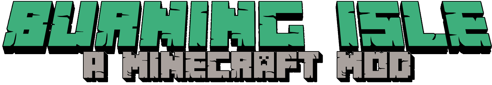

# Using Vue in Markdown

## Browser API Access Restrictions

Because VuePress applications are server-rendered in Node.js when generating static builds, any Vue usage must conform to the [universal code requirements](https://ssr.vuejs.org/en/universal.html). In short, make sure to only access Browser / DOM APIs in `beforeMount` or `mounted` hooks.

If you are using or demoing components that are not SSR friendly (for example containing custom directives), you can wrap them inside the built-in `<ClientOnly>` component:

## HH

<recipe-crafting slot_1="ink_sac" slot_4="glass_bottle" result="bottle_of_ink"/>

<Item name="glass_bottles"/>

## Seperator

<ImgInfo>
  <template v-slot:img>
    <Item name="glass_bottle"/>
  </template>
  <template v-slot:info>
    A really lon text with some important info, you dont want ot miss.
  </template>

</ImgInfo>

