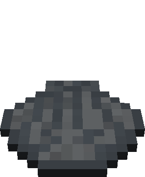

# Magmatic Shells

In the Basalt Deltas, an intriguing variety of shells awaits discovery, distinguished by four distinct sizes: Big, Medium, Small, and Very Small. These Magmatic Shells, scattered throughout the landscape, hold within them a trove of treasures, often unveiling [glistening Pearls](../items/pearls.md#pearls).

:::: code-group

::: code-group-item Open

<tooltip-item item_name="Big Magmatic Shell"></tooltip-item>
<tooltip-item item_name="Medium Magmatic Shell"></tooltip-item>
<tooltip-item item_name="Small Magmatic Shell"></tooltip-item>
<tooltip-item item_name="Very Small Magmatic Shell"></tooltip-item>

:::
::: code-group-item Closed
<tooltip-item item_name="Big Magmatic Shell"></tooltip-item>
<tooltip-item item_name="Medium Magmatic Shell"></tooltip-item>
<tooltip-item item_name="Small Magmatic Shell"></tooltip-item>
<tooltip-item item_name="Very Small Magmatic Shell" loading="lazy"></tooltip-item>
:::
::::

 Beyond their role as treasure troves, these shells also serve as the habitat for [Magmatic Fireflies](../entities/firefly.md).

::: tip Magmatic Firefly Food Item
The vermy small Magmatic shell is Food for all [Magmatic Fireflies](../entities/firefly.md#magmatic-firefly)
:::