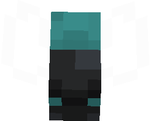
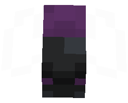
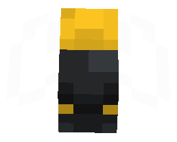

# Magmatic firefly

The Magmatic Firefly, an enchanting passive creature, comes to life amidst the Nether's mysterious expanse. Its captivating presence is further enriched by the diverse variants it assumes based on the biome it inhabits:

:::: code-group
::: code-group-item Magmatic
<ImgInfo class=group-padding>
  <template v-slot:img>
    <tooltip-firefly name="Magmatic Firefly" variant="Magmatic" color="#c23d15"></tooltip-firefly>
  </template>
  <template v-slot:info>
    The Magmatic variant stands as a testament to the creature's original form.
  </template>
</Imginfo>
:::

::: code-group-item Crimson
<ImgInfo class=group-padding>
  <template v-slot:img>
    <tooltip-firefly name="Magmatic Firefly" variant="Crimosn" color="#8a5568"></tooltip-firefly>
  </template>
  <template v-slot:info>
  Crimson Fireflies grace the Crimson Forest with their unique presence.
  </template>
</Imginfo>
:::

::: code-group-item Warped
<ImgInfo class=group-padding>
  <template v-slot:img>
    <tooltip-firefly name="Magmatic Firefly" variant="Warped" color="#388785"></tooltip-firefly>
  </template>
  <template v-slot:info>
    In the Warped Forest, the Warped variant enchants the surroundings.
  </template>
</Imginfo>
:::

::: code-group-item Mauvéine
<ImgInfo class=group-padding>
  <template v-slot:img>
    <tooltip-firefly name="Magmatic Firefly" variant="Mauveine" color="#582f60"></tooltip-firefly>
  </template>
  <template v-slot:info>
    The rare Mauvéine variant finds its home within the enigmatic Mauvéine Forest.
  </template> 
</Imginfo>
:::

::: code-group-item Palistrom
<ImgInfo class=group-padding>
  <template v-slot:img>
    <tooltip-firefly name="Magmatic Firefly" variant="Palistrom" color="#f4bd1f"></tooltip-firefly>
  </template>
  <template v-slot:info>
    Across all forests, the elusive Palistrom variation occasionally makes its appearance, delighting lucky observers.
  </template>
</Imginfo>
:::
::::

A touch of culinary magic resides within these creatures, as they gracefully adopt the hues of their surroundings when offered a variety of food items. This transformational feat extends to potions as well, with Fireflies imbibing them to wield their effects with grace.

These mesmerizing beings hold another secret – a penchant for seeking out [Magmatic Shells](../blocks/shell.md), in which they find refuge. Leaving behind a small treasure

