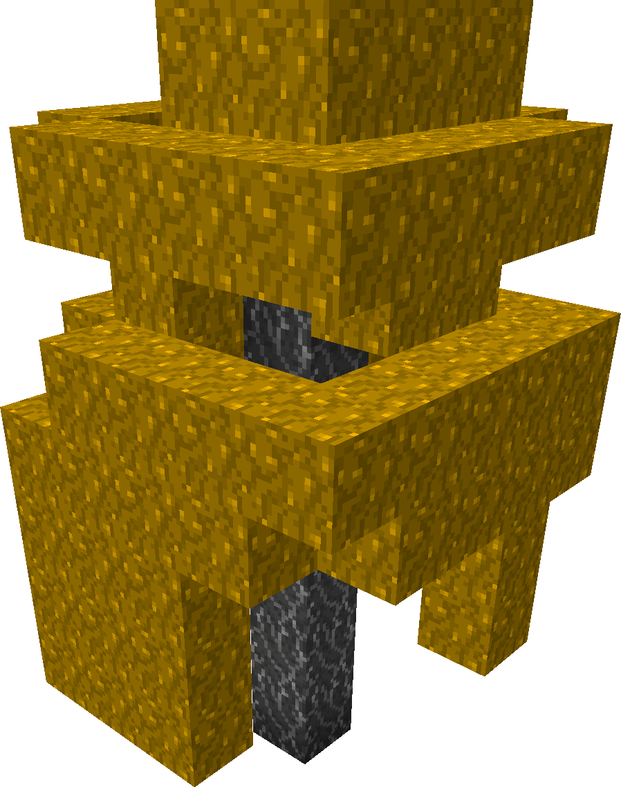

# Palistrom Fungus

Palistrom Fungi can be found rarely in the Crimson or Warped Forest.
Or more commenly in Mauveine Forest.

Depeding on the Biome Palistrom Fungi can carry Froglights
<Item name="ochre_froglight"/>
<Item name="verdant_froglight"/>
<Item name="pearlescent_froglight"/>

See also [Palsitrom Fungus](../blocks/palistrom.md)
